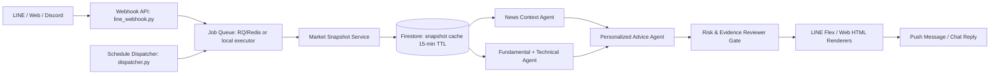

# AIAgent LineStock — Evidence-Based Stock Research Assistant

A production-ready, multi-agent stock research assistant on **LINE / Web / Discord**, powered by a **resilient free-tier LLM provider chain** (automatic failover with context forwarding) and deterministic Python financial services. Reports are delivered as interactive LINE Flex Message cards, grounded in real market data — never hallucinated numbers.

---

## 📌 Table of Contents
1. [Overview & Architecture](#-overview--architecture)
2. [LLM Provider Chain (Free-Tier Failover)](#-llm-provider-chain-free-tier-failover)
3. [Multi-Agent System & Reasoning Souls](#-multi-agent-system--reasoning-souls)
4. [Analysis Layer — Evidence-Based, Not LLM Math](#-analysis-layer--evidence-based-not-llm-math)
5. [Source Structure](#-source-structure)
6. [Data Layer — Firestore Store](#-data-layer--firestore-store)
7. [Market Data Providers](#-market-data-providers)
8. [Queue, Dispatcher & Workers](#-queue-dispatcher--workers)
9. [Channels](#-channels)
10. [Tech Stack & Dependencies](#-tech-stack--dependencies)
11. [Environment Variables](#-environment-variables)
12. [Local Development & Testing](#-local-development--testing)
13. [Deployment Guide (GCP Cloud Run + Secret Manager)](#-deployment-guide-gcp-cloud-run--secret-manager)

---

## 🎯 Overview & Architecture

Users register stocks to a personal watchlist, configure their investment style, and receive structured reports based on fresh price data, precomputed technical indicators, company fundamentals, and ranked news with provenance.

The system emphasizes **decision support** — never raw `BUY`/`SELL` orders or guaranteed-return promises.



### Key UX guarantees
- **Instant ack + press debounce**: every analysis button replies with a "⏳ processing" ack immediately; repeated presses within 30 s per user/action/symbol are locked (no duplicate AI calls, no duplicate cards).
- **News detail on demand**: the summary card shows 2-line telegraph-style headlines; the **News** button opens a full card ranked by market impact, per-news verdict, "why it matters" line, and a tappable **original-source button** (URLs come only from the digest, never LLM-invented).
- **Three-bucket reasons**: every recommendation separates evidence into 📰 News / 🏦 Financial statements / 📊 Statistics (P/E, RSI, support-resistance with derivation).

---

## 🔌 LLM Provider Chain (Free-Tier Failover)

No single-provider lock-in. Providers run in a configurable order; on failure (429, 404, timeout, missing key) the **same prompt + context is forwarded** to the next provider automatically.

Default order (Gemini direct API currently disabled due to billing):

```
groq → cerebras → mistral → cloudflare → openrouter → unorouter → router9 → ollama
```

| Provider | Default model | Notes |
|---|---|---|
| Groq | `llama-3.1-8b-instant` | fastest free tier |
| Cerebras | `llama-3.3-70b` | |
| Mistral | `mistral-small-latest` | |
| Cloudflare Workers AI | `meta/llama-3.1-8b-instruct` | |
| OpenRouter | `deepseek/deepseek-chat-v3.1:free` | one key, many free models |
| UnoRouter | `google/gemini-3-flash:free` | OpenRouter-style slugs |
| 9Router | `auto` | local proxy (localhost:20128) — dev only |
| Ollama | `mistral-small3.2:24b` | fully local, offline dev/test |

**404 self-healing**: when a configured model no longer exists, the provider fetches the live `/models` list and picks the closest available model, then caches it — stale model names in env vars no longer break the chain.

Structured JSON tasks (news analysis, agent outputs) validate against Pydantic schemas; invalid responses fall through to the next provider or a deterministic fallback.

---

## 🤖 Multi-Agent System & Reasoning Souls

The workflow orchestrates four specialist agents with version-controlled Markdown system instructions (`src/agents/souls/`):

1. **`NewsContextAgent`** (`news_context.md`): filters and ranks company + macro news; retains provenance (title, source, URL, published time).
2. **`FundamentalTechnicalAgent`** (`fundamental_technical.md`): interprets precomputed price, P/E, dividend yield, and technical indicators; never hallucinates prices or recalculates indicators.
3. **`PersonalizedAdviceAgent`** (`personalized_advice.md`): synthesizes findings with user strategy, goal, and risk appetite into three-bucket evidence-based reasons, tangible risks, and items to watch.
4. **`RiskEvidenceReviewer`** (`risk_evidence_reviewer.md`): independent compliance gatekeeper — rejects unsupported claims, stale data (>15 min), or forbidden words ("การันตี", "กำไรแน่นอน"). Returns `approve` / `revise` / `reject`.

---

## 🧮 Analysis Layer — Evidence-Based, Not LLM Math

| Module | Responsibility |
|---|---|
| `analysis/indicators.py` | RSI-14, SMA-20/50, 30-day volatility, support/resistance (30-day swing low/high), 52-week range — pure pandas |
| `analysis/chart_service.py` | 30-day sparkline charts via QuickChart |
| `analysis/financial_ratios.py` | D/E, net margin, ROE, P/B computed from raw balance-sheet values, each rendered with its formula in Thai |
| `analysis/news_cleaning.py` | strips `$undefined$`/URL garbage from headlines, cross-publisher dedupe, impact scoring & ranking |
| `analysis/news_analysis.py` | numbered-source digest → single LLM synthesis pass with citation contract ([1], [2]…), tech/macro linkage, Buy/Hold/Sell reasoning |

The LLM only **interprets**; every number originates from deterministic Python code or real provider data.

---

## 📂 Source Structure

```text
src/
  api/
    line_webhook.py              # LINE webhook: routing, acks, debounce locks, handlers
    web_chat.py                  # Web chat endpoint (HTML briefs)
  data/
    providers/
      base.py                    # MarketDataProvider & NewsDataProvider interfaces + skip/failover
      yahoo_provider.py          # Global quotes, history, financials
      thai_market_provider.py    # SET equities (.BK)
      settrade_open_provider.py  # Official SET feed (Thai-only, skip if unconfigured)
      news_provider.py           # Company & macro news with provenance
      relay_provider.py          # Local data relay via Cloudflare Tunnel
      legacy_provider.py         # Backwards-compatibility adapter
    market_snapshot_service.py   # Snapshot collection, 15-min cache reuse, source tracking
    financials_service.py        # Balance-sheet fetch + raw values for ratio math
  analysis/
    indicators.py                # Deterministic technical indicators
    financial_ratios.py          # Ratio computation with Thai formula explanations
    news_cleaning.py             # Headline cleaning, dedupe, impact ranking
    news_analysis.py             # Numbered-source AI synthesis with citations
    chart_service.py             # QuickChart sparklines
  agents/
    contracts.py                 # Pydantic schemas
    runner.py                    # Agent runner: JSON validation & fallbacks
    news_context_agent.py / fundamental_technical_agent.py /
    personalized_advice_agent.py / risk_evidence_reviewer.py
    souls/                       # Markdown system prompts per agent
  workflows/
    report_workflow.py           # Parallel orchestration + audit logging
  tasks/
    dispatcher.py                # Cron scheduler & schedule claim
    queue.py                     # RQ/Redis queue with local thread-pool fallback
    worker.py                    # Report job processor, idempotent push (UUID retry key)
  reporting/
    line_report_renderer.py      # Stock card / Daily digest / Market Brief flex builders
    news_detail_renderer.py      # Impact-ranked news card with source buttons
    web_chat_renderer.py         # Web chat HTML renderers
  models/
    analysis_models.py           # Pydantic v2 data models
  store.py                       # Data layer: Firestore backend + in-memory dev backend
  llm_providers.py               # Provider chain router with failover + 404 self-heal
  llm_service.py / llm_test_cli.py
  chat_service.py                # Cross-channel command dispatch (LINE/Web/Discord)
  discord_bot.py                 # Discord bot entrypoint
  line_templates.py              # Rich menu / carousel templates
  global_stock_helper.py / thai_stock_helper.py
  data_relay_agent.py            # Local machine data relay (Cloudflare Tunnel)
  app.py                         # Flask application server
  config.py                      # Configuration (env parsing, secret-file support)
  worker.py                      # CLI entrypoint for scheduler / RQ worker
```

---

## 🗄 Data Layer — Firestore Store

All persistence runs through a single store layer (`src/store.py`) with two swappable backends:

- **Firestore** (production): database `agent-stocks`, authenticated via Application Default Credentials on Cloud Run — no extra secrets needed. Lazy-initialized so cold starts stay fast.
- **In-memory** (local dev/test): automatic fallback when Firestore is unavailable; force with `DATA_BACKEND=memory`.

Collections:

| Collection | Purpose |
|---|---|
| `users` (+ watchlist subcollection) | Profile, investment style, tracked stocks |
| `schedules` | Scheduled alert delivery times |
| `market_snapshots` | Cached market data (15-min TTL, shared across users) |
| `financial_cache` | Balance-sheet cache (24-h TTL) |
| `analysis_runs` / `agent_outputs` | Audit trail of every workflow run & agent stage |
| `report_deliveries` | Idempotency keys — no duplicate pushes |
| `global_stock_info` | Cached global stock metadata |
| action locks | 30-s press-debounce per user/action/symbol |

> Migrated from Supabase/PostgreSQL + SQLAlchemy in 2026-09; no ORM, no migrations needed.

---

## 🌐 Market Data Providers

Market data also runs as a **provider chain** (Thai-first):

```
settrade_open (Thai .BK, official feed) → yahoo → local relay → skip
```

- **Settrade Open API**: official Thai feed; skipped gracefully when credentials are absent. Sandbox accessible only from Thai IPs (since 16 Sep 2026).
- **Yahoo Finance**: global quotes, history, financials.
- **FMP**: balance-sheet fallback when Yahoo blocks.
- **Local data relay**: run a fetcher on your home machine and expose it via Cloudflare Tunnel (`DATA_RELAY_URL`) to bypass cloud-IP blocks (e.g., Finnhub on GCP).
- News: Google News RSS with cleaning/dedup/ranking (`news_cleaning.py`).

---

## 🔄 Queue, Dispatcher & Workers

1. **Webhook** — acks instantly, enqueues background job.
2. **Job queue** — Redis + RQ in production; automatic local thread-pool executor in dev.
3. **Idempotency** — every push carries a canonical-UUID `X-Line-Retry-Key`; `report_deliveries` blocks duplicate deliveries across webhook redelivery or job retries.
4. **Dispatcher** — cron-style schedule scanner (`src/worker.py`) claims due schedules and enqueues digest jobs.

---

## 💬 Channels

| Channel | Entrypoint | Notes |
|---|---|---|
| **LINE** | `src/app.py` (`/callback`) | Flex cards, rich menu, postbacks, debounce locks |
| **Web chat** | `src/api/web_chat.py` | HTML-rendered briefs/reports |
| **Discord** | `src/discord_bot.py` | runs separately (`python src/discord_bot.py`) |

Shared command layer: `src/chat_service.py` dispatches identical commands across all three channels.

---

## 🧰 Tech Stack & Dependencies

| Layer | Technology |
|---|---|
| Language | Python 3.11 |
| Web | Flask 3 + gunicorn |
| Messaging | line-bot-sdk, discord.py |
| LLM | google-genai + OpenAI-compatible chain (Groq, Cerebras, Mistral, Cloudflare, OpenRouter, UnoRouter, 9Router, Ollama) |
| Data | yfinance, pandas, requests |
| Persistence | google-cloud-firestore (prod) / in-memory (dev) |
| Queue | redis + rq (optional) |
| Scheduler | apscheduler |
| Validation | pydantic v2 |
| Orchestration (roadmap) | langgraph |
| Deploy | Docker → GCP Cloud Run, Secret Manager, scale-to-zero |

---

## ⚙ Environment Variables

Copy `.env_example` → `.env` and fill in only what you use — **empty key = provider skipped**:

```env
# ==== LLM Providers (any subset) ====
GROQ_API_KEY=
CEREBRAS_API_KEY=
MISTRAL_API_KEY=
CLOUDFLARE_API_KEY=          # + CLOUDFLARE_ACCOUNT_ID
OPENROUTER_API_KEY=
UNOROUTER_API_KEY=           # hosted gateway (unorouter.com)
ROUTER9_BASE_URL=            # local proxy, dev only
OLLAMA_BASE_URL=http://localhost:11434   # local dev only
LLM_PROVIDER_ORDER=groq,cerebras,mistral,cloudflare,openrouter,unorouter,router9,ollama

# ==== Market data ====
FINNHUB_API_KEY=
TWELVE_DATA_API_KEY=
SETTRADE_APP_ID=             # optional official Thai feed
SETTRADE_APP_SECRET=
FMP_API_KEY=                 # balance-sheet fallback
DATA_RELAY_URL=              # home-machine relay via Cloudflare Tunnel
DATA_RELAY_TOKEN=

# ==== LINE API ====
LINE_CHANNEL_SECRET=
LINE_CHANNEL_ACCESS_TOKEN=

# ==== Discord (optional) ====
DISCORD_BOT_TOKEN=

# ==== Database ====
# empty = in-memory local backend; Firestore is used automatically on GCP
DATABASE_URL=
REDIS_URL=
```

**Secret-file mode (GCP)**: the app can parse an entire `.env` file mounted as a single secret. Set env var `ENV_FILE` (or `ENV_STOCKS`) to the file content — lines are parsed as `KEY=VALUE`, comments skipped, quotes stripped. See `src/config.py`.

---

## 🧪 Local Development & Testing

```bash
# 1. Install dependencies (Python 3.11 recommended)
pip install -r requirements.txt

# 2. Run test suite (in-memory backend, no network needed)
DATA_BACKEND=memory python -m unittest discover -s tests -v

# 3. Run application server (webhook + web chat)
python src/app.py

# 4. Run scheduler / RQ worker
python src/worker.py        # schedule dispatcher
python src/worker.py rq     # standalone RQ worker (needs Redis)

# 5. Discord bot (optional)
python src/discord_bot.py

# 6. Test LLM provider chain locally (e.g., Ollama)
python src/llm_test_cli.py

# 7. Optional: expose local server for LINE webhook testing
cloudflared tunnel --url http://localhost:8080
# → paste the URL into LINE Console → Webhook URL
```

---

## 🚀 Deployment Guide (GCP Cloud Run + Secret Manager)

### 1. Secrets
Create **one secret per value** (name = exact env var name, value = raw value only — do not upload a whole `.env` as one secret), or use the file mode with a single `env_stocks` secret:

```bash
printf "%s" "VALUE" | gcloud secrets create LINE_CHANNEL_SECRET --data-file=-
printf "%s" "VALUE" | gcloud secrets create LINE_CHANNEL_ACCESS_TOKEN --data-file=-
printf "%s" "VALUE" | gcloud secrets create UNOROUTER_API_KEY --data-file=-
```

### 2. Deploy

```bash
gcloud run deploy agent-stocks-service \
  --source . --region asia-southeast1 \
  --min-instances 0 --max-instances 2 --memory 512Mi --timeout 300 \
  --set-secrets="ENV_STOCKS=env_stocks:latest"
```

- Scale-to-zero keeps cost near the free tier; cold starts mitigated by lazy store/LLM initialization.
- Firestore uses the Cloud Run service account (grant `roles/datastore.user` if permission errors appear).
- Debug endpoints: `/health` (liveness) and `/debug/config` (reports which env vars reached the container, without exposing values).

### 3. LINE Console
Set webhook URL to `https://<service-url>/callback`, enable *Use webhook*, disable *Auto-reply messages*, then Verify.

---

## 🧭 Roadmap
- **BigQuery** (`stocks_query`): analytics warehouse over `analysis_runs` for historical accuracy dashboards.
- **LangGraph**: explicit conditional-branching and reflection loops over the news pipeline (dedupe → relevance gate → analysis → fact-check reflection).
- **Settrade production credentials** for live Thai-market trading-grade data.
